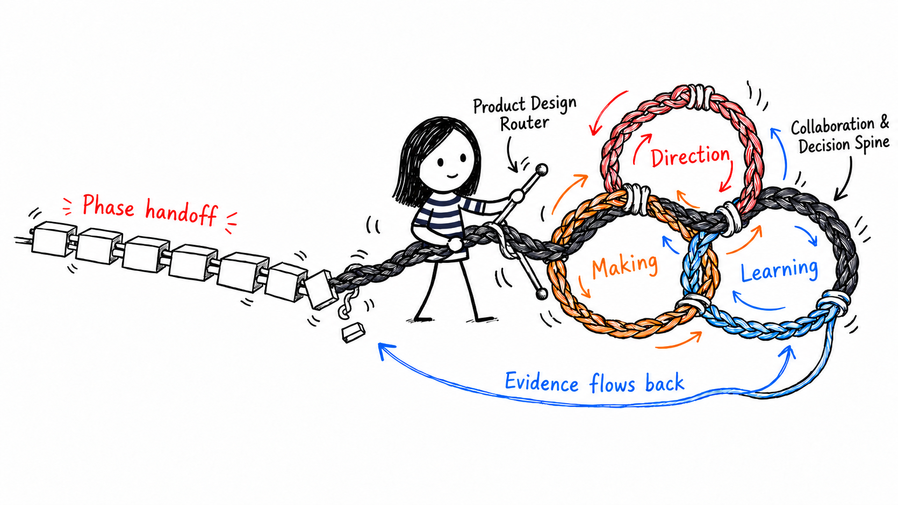

<p align="center">
  <strong>English</strong> · <a href="./README.zh-CN.md">简体中文</a>
</p>

<h1 align="center">Product Designer Skills OS</h1>

<p align="center">
  <strong>An uncertainty-driven skill network for product designers and independent builders working with AI.</strong>
</p>

<p align="center">
  <a href="https://github.com/jiayuewangjavy/product-designer-skills-os/actions/workflows/validate.yml"></a>
  <a href="./LICENSE"></a>
  
  
</p>

<p align="center">
  
</p>

> **AI-native design process is a learning control loop.**
> Route from the highest-risk unknown, preserve shared context and decision ownership, learn from evidence, and update the next move.

## Why this exists

AI makes PRDs, flows, prototypes, interfaces, and code cheaper to produce. It can also make unanswered questions look settled.

Product Designer Skills OS does not automate a fixed `Discovery → Design → Build → Launch` sequence. Its router inspects what already exists—a brief, prototype, codebase, user signal, or market result—and chooses the smallest skill loop that can reduce the most consequential uncertainty.

## How it works: the Router is the core

[`product-design-router`](./skills/product-design-router/) is not simply one skill in the collection. It is the **control plane for the entire OS**.

```text
brief · prototype · code · user signal · market result
                          ↓
               product-design-router
     decision + highest-risk unknown + working surface
                          ↓
            compose the smallest useful loop
                          ↓
       Direction ↔ Making ↔ Learning
          ═ Collaboration & Decision Spine ═
                          ↓
      what we learned · what changed · next unknown
                          └──────────────↺ Router
```

The Router performs four jobs:

1. **Ground** — identify the working artifact, decision owner, contributors, and human / AI authority boundary.
2. **Diagnose** — determine which unknown is most likely to cause failure or expensive rework.
3. **Compose** — select the working surface, one primary skill, and only the support needed to produce credible evidence.
4. **Close and route again** — require the accountable owner to update the decision, then use the next unknown to begin another loop.

The specialist skills do the product work. The Router decides **why this work, why now, where it should happen, who owns the decision, and what evidence is enough to stop**. This keeps the collection dynamic without turning it into an undisciplined set of prompts.

## Start here

| What you have now | Start with | Decision it helps unlock |
|---|---|---|
| “I do not know what to do next” | **`product-design-router`** | Which unknown deserves the next loop |
| An idea with scattered evidence | `product-context` + `opportunity-and-assumption-map` | Which product bet is worth testing |
| A brief that does not translate into a coherent product | `conceptual-model-design` | What objects, actions, states, and rules the experience needs |
| A prototype request that keeps expanding | `prototype-question` | What the minimum prototype must prove |
| A question that requires real interaction | `interactive-prototype` | Which runnable behavior can produce evidence |
| “It looks fine, but something feels wrong” | `design-judgment-scorecard` | What should change, why, and how to verify it |
| An AI revision that may have changed the product | `intent-preservation-check` | What was preserved, intentionally changed, unresolved, or lost |
| A product that needs users, not just a launch post | `position-and-launch-hypothesis` | Who should adopt it and which signal matters |
| Test, usage, launch, or operational results | `learning-loop-readout` | Which assumption, context, or decision should change |

## Install

List the available skills without installing:

```bash
npx skills add jiayuewangjavy/product-designer-skills-os --list
```

Install the Router and shared Context for Codex:

```bash
npx skills add jiayuewangjavy/product-designer-skills-os \
  --skill product-design-router \
  --skill product-context \
  --agent codex --global
```

Install the full V0 collection for Codex:

```bash
npx skills add jiayuewangjavy/product-designer-skills-os \
  --skill '*' --agent codex --global
```

The [`skills` CLI](https://github.com/vercel-labs/skills) also supports Claude Code, Cursor, OpenCode, and many other agents. You can instead clone the repository and copy selected folders from `skills/` into your agent's skill directory.

After installation, try:

```text
Use $product-design-router to identify the highest-risk unknown in this product work and recommend the smallest skill loop.
```

## The V0 collection

| Network role | Skill | Purpose |
|---|---|---|
| **Core control plane** | **[`product-design-router`](./skills/product-design-router/)** | Ground ownership, diagnose the highest-risk unknown, select the working surface, and compose the smallest loop |
| Shared context | [`product-context`](./skills/product-context/) | Preserve evidence, assumptions, decisions, and constraints |
| Direction | [`opportunity-and-assumption-map`](./skills/opportunity-and-assumption-map/) | Find the riskiest belief behind a product bet |
| Structure | [`conceptual-model-design`](./skills/conceptual-model-design/) | Model roles, objects, relationships, states, and rules |
| Evidence design | [`prototype-question`](./skills/prototype-question/) | Define what a prototype must prove and when to stop |
| Making | [`interactive-prototype`](./skills/interactive-prototype/) | Build the minimum runnable interaction needed for evidence |
| Evaluation | [`design-judgment-scorecard`](./skills/design-judgment-scorecard/) | Turn design judgment into explainable findings and tradeoffs |
| Intent governance | [`intent-preservation-check`](./skills/intent-preservation-check/) | Detect when AI-generated revisions erase confirmed intent |
| Adoption | [`position-and-launch-hypothesis`](./skills/position-and-launch-hypothesis/) | Connect positioning and launch to measurable behavior |
| Learning | [`learning-loop-readout`](./skills/learning-loop-readout/) | Convert product signals into context and decision updates |

## Choose a profile

- [`Designer Core`](./profiles/designer-core.md) emphasizes product structure, experience, and judgment.
- [`Builder Core`](./profiles/builder-core.md) emphasizes value, feasibility, adoption, and learning.
- [`Full Collection`](./profiles/full-collection.md) includes every V0 node. It is not a required sequence.

## The shared contract

Every composed loop shares a collaboration and decision spine:

```text
working artifact · working surface · decision owner
· contributors and agents · human / AI authority · required approval
```

It then carries forward five learning fields:

```text
what we knew
→ what we made
→ what we learned
→ what changed
→ the next unknown
```

An artifact does not close a loop. Evidence must explicitly retain, revise, reject, or defer a product decision, and the accountable owner remains visible as work moves among canvas, prototype, code, and live signals. See [`LOOP-CONTRACT.md`](./references/LOOP-CONTRACT.md).

## Boundaries

- No third-party skill implementation is vendored.
- No hidden runtime dependency, network request, credential handling, or automatic publishing is included.
- Evidence, assumptions, decisions, and preferences remain distinct.
- A polished artifact is not treated as proof of value or usability.
- Plans for publishing, outreach, payment, deployment, deletion, or other external changes still require authorization.
- High-risk ambiguity remains a human decision.

Method influences, reviewed commits, and license boundaries are documented in [`SOURCES.md`](./references/SOURCES.md). Security and mutation boundaries are documented in [`SECURITY.md`](./SECURITY.md).

## Project status

This is a **working V0**, not a finished universal design curriculum. Static validation covers all 10 skills, and the first routing case is documented in [`evals/prototype-first.md`](./evals/prototype-first.md). Real-task evaluation is still required before claiming improved product outcomes or reduced rework.

## Feedback

Try the Router on a real brief, prototype, or product signal. If it chooses the wrong unknown, opens too large a loop, or loses a confirmed decision, [open an issue](https://github.com/jiayuewangjavy/product-designer-skills-os/issues).

## License

Original package content is released under the [MIT License](./LICENSE). Third-party sources retain their own licenses; no third-party implementation is included in this repository.
