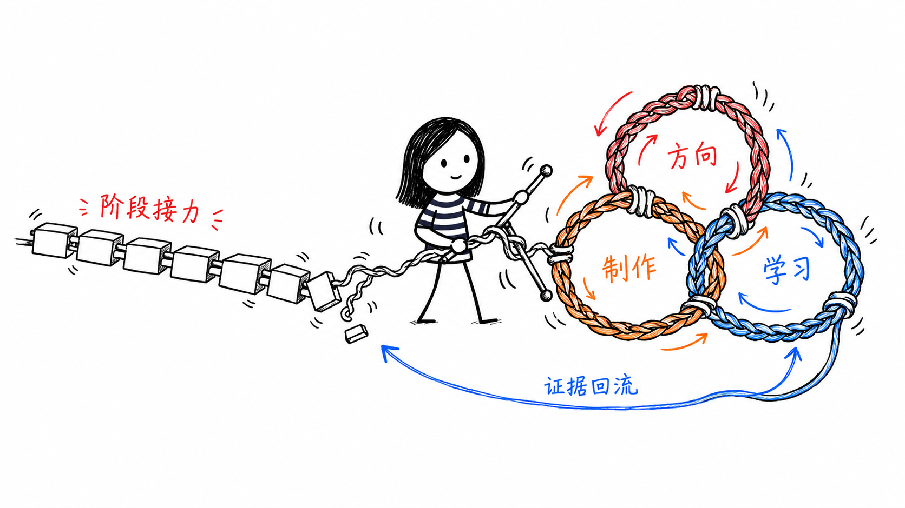

<p align="center">
  <a href="./README.md">English</a> · <strong>简体中文</strong>
</p>

<h1 align="center">Product Designer Skills OS</h1>

<p align="center">
  <strong>一套面向 Product Designer 与独立 Product Builder 的 AI 原生动态能力网络。</strong>
</p>

<p align="center">
  <a href="https://github.com/jiayuewangjavy/product-designer-skills-os/actions/workflows/validate.yml"></a>
  <a href="./LICENSE"></a>
  
  
</p>

<p align="center">
  
</p>

> **Design process 没有死，死的是固定的部门流水线。**
> 从最大的未知开始，用最小 artifact 获得证据，再把学习回写到产品决定。

## 为什么做这个项目

AI 让 PRD、流程、Prototype、界面和代码的制作成本快速下降，也更容易让尚未回答的问题看起来已经确定。

Product Designer Skills OS 不自动执行一条固定的 `Discovery → Design → Build → Launch` 流程。Router 会先检查已经存在的 brief、prototype、code、用户信号或市场结果，然后选择一个能够降低最大不确定性的最小 Skill Loop。

```text
              Direction Loop
       Signals ↔ Frame ↔ Choose a Bet
            ↙                 ↘
Making Loop ↔ shared context ↔ Learning Loop
Model ↔ Prototype ↔ Build      Ship ↔ Observe ↔ Adapt
```

## 从哪里开始

| 你现在有什么 | 建议入口 | 帮助完成的决定 |
|---|---|---|
| “我不知道下一步该做什么” | `product-design-router` | 当前哪个未知最值得进入下一轮 |
| 一个想法和分散的证据 | `product-context` + `opportunity-and-assumption-map` | 哪个产品假设值得验证 |
| Brief 无法变成结构一致的产品 | `conceptual-model-design` | 体验需要哪些对象、动作、状态和规则 |
| Prototype 范围不断变大 | `prototype-question` | 最小 Prototype 必须证明什么 |
| 必须通过真实交互才能回答的问题 | `interactive-prototype` | 哪个可运行行为能够产生证据 |
| “看起来没问题，但就是感觉不对” | `design-judgment-scorecard` | 应该改什么、为什么，以及如何验证 |
| AI 修改可能改变了原始产品意图 | `intent-preservation-check` | 哪些被保留、主动改变、悬而未决或意外丢失 |
| 产品需要真实采用，而不只是发一条 Launch Post | `position-and-launch-hypothesis` | 谁会采用，以及什么信号才有意义 |
| 已经有测试、使用、Launch 或运营结果 | `learning-loop-readout` | 哪个假设、上下文或决定应该改变 |

## 安装

先查看仓库中可以安装的 Skills：

```bash
npx skills add jiayuewangjavy/product-designer-skills-os --list
```

为 Codex 安装 Router 和共享 Context：

```bash
npx skills add jiayuewangjavy/product-designer-skills-os \
  --skill product-design-router \
  --skill product-context \
  --agent codex --global
```

为 Codex 安装全部 V0 Skills：

```bash
npx skills add jiayuewangjavy/product-designer-skills-os \
  --skill '*' --agent codex --global
```

[`skills` CLI](https://github.com/vercel-labs/skills) 同时支持 Claude Code、Cursor、OpenCode 等 Agent。你也可以 clone 这个仓库，再把需要的 `skills/` 子目录复制到对应 Agent 的 Skill 目录。

安装后可以这样开始：

```text
Use $product-design-router to identify the highest-risk unknown in this product work and recommend the smallest skill loop.
```

## V0 包含的 Skills

| 网络角色 | Skill | 作用 |
|---|---|---|
| Control | [`product-design-router`](./skills/product-design-router/) | 根据未知路由并定义退出条件 |
| Shared context | [`product-context`](./skills/product-context/) | 保存证据、假设、决定与约束 |
| Direction | [`opportunity-and-assumption-map`](./skills/opportunity-and-assumption-map/) | 找到当前产品假设中风险最高的部分 |
| Structure | [`conceptual-model-design`](./skills/conceptual-model-design/) | 建立角色、对象、关系、状态和规则 |
| Evidence design | [`prototype-question`](./skills/prototype-question/) | 定义 Prototype 要证明什么以及何时停止 |
| Making | [`interactive-prototype`](./skills/interactive-prototype/) | 制作获得证据所需的最小可运行交互 |
| Evaluation | [`design-judgment-scorecard`](./skills/design-judgment-scorecard/) | 把设计判断转化成可解释的发现和取舍 |
| Intent governance | [`intent-preservation-check`](./skills/intent-preservation-check/) | 检查 AI 修改是否意外删除已确认意图 |
| Adoption | [`position-and-launch-hypothesis`](./skills/position-and-launch-hypothesis/) | 将定位与 Launch 连接到可测量行为 |
| Learning | [`learning-loop-readout`](./skills/learning-loop-readout/) | 把产品信号转化为上下文和决定更新 |

## 选择安装配置

- [`Designer Core`](./profiles/designer-core.md)：更关注产品结构、体验和设计判断。
- [`Builder Core`](./profiles/builder-core.md)：更关注价值、可行性、采用和持续学习。
- [`Full Collection`](./profiles/full-collection.md)：包含 V0 的全部节点，但不是一条必须顺序执行的流程。

## 跨 Skill Contract

每个组合 Loop 都需要保留五件事：

```text
我们已经知道什么
→ 制作了什么
→ 学到了什么
→ 什么决定发生了变化
→ 下一个最大的未知是什么
```

完成 artifact 不代表 Loop 已经关闭。证据必须明确地保留、修改、否决或推迟一个产品决定。详细定义见 [`LOOP-CONTRACT.md`](./references/LOOP-CONTRACT.md)。

## 边界

- 不包含任何复制进来的第三方 Skill 实现。
- 没有隐藏的运行时依赖、网络请求、凭据处理或自动发布行为。
- Evidence、Assumption、Decision 和 Preference 必须保持区分。
- 视觉完整的 artifact 不等于已经证明产品价值或可用性。
- 发布、外联、收费、部署、删除等外部操作仍需用户明确授权。
- 高风险和高模糊度决定继续由人负责。

方法来源、审查 commit 和许可证边界记录在 [`SOURCES.md`](./references/SOURCES.md)，安全与外部操作边界记录在 [`SECURITY.md`](./SECURITY.md)。

## 当前状态

这是一个 **working V0**，不是已经完成的 Product Designer 通用课程。静态验证覆盖全部 10 个 Skills，第一个 Router 测试案例记录在 [`evals/prototype-first.md`](./evals/prototype-first.md)。在完成真实任务测试前，不宣称它已经提高产品结果或减少返工。

## 反馈

请用一个真实 brief、prototype 或产品信号测试 Router。如果它选择了错误的未知、打开了过大的 Loop，或者丢失了已确认决定，可以 [提交 Issue](https://github.com/jiayuewangjavy/product-designer-skills-os/issues)。

## License

本项目原创内容使用 [MIT License](./LICENSE)。第三方来源继续使用各自的许可证；本仓库没有包含第三方实现。
